Analyses for 'The practices of open prison and conditional release and their relation to recidivism rates'
================

-   [Setup](#setup)
-   [Data - Load and subset](#data---load-and-subset)
-   [Create subgroups](#create-subgroups)
-   [Matching](#matching)
    -   [Define sets of predictors](#define-sets-of-predictors)
    -   [Matching function](#matching-function)
    -   [Do the matching for each subset.](#do-the-matching-for-each-subset.)
    -   [Checks](#checks)
-   [Logistic regression analyses](#logistic-regression-analyses)
    -   [Function for logistic regressions](#function-for-logistic-regressions)
    -   [Run analyses](#run-analyses)
    -   [Results](#results)
        -   [Effect: Open Prison. Subset: NOT Supervised](#effect-open-prison.-subset-not-supervised)
        -   [Effect: Open Prison. Subset: Supervised](#effect-open-prison.-subset-supervised)
        -   [Effect: CR. Subset: NOT Supervised](#effect-cr.-subset-not-supervised)
        -   [Effect: CR. Subset: Supervised](#effect-cr.-subset-supervised)
-   [Plots](#plots)

Setup
=====

Load needed packages

``` r
library(tidyverse)
```

    ## -- Attaching packages ------------------------------------------------------------------------ tidyverse 1.2.1 --

    ## v ggplot2 2.2.1     v purrr   0.2.4
    ## v tibble  1.4.1     v dplyr   0.7.4
    ## v tidyr   0.7.2     v stringr 1.2.0
    ## v readr   1.1.1     v forcats 0.2.0

    ## -- Conflicts --------------------------------------------------------------------------- tidyverse_conflicts() --
    ## x dplyr::filter() masks stats::filter()
    ## x dplyr::lag()    masks stats::lag()

``` r
library(stringr)
library(MatchIt)
library(ggthemes)
library(gridExtra)
```

    ## 
    ## Attaching package: 'gridExtra'

    ## The following object is masked from 'package:dplyr':
    ## 
    ##     combine

``` r
sessionInfo()
```

    ## R version 3.4.3 (2017-11-30)
    ## Platform: x86_64-w64-mingw32/x64 (64-bit)
    ## Running under: Windows 10 x64 (build 16299)
    ## 
    ## Matrix products: default
    ## 
    ## locale:
    ## [1] LC_COLLATE=Swedish_Finland.1252  LC_CTYPE=Swedish_Finland.1252   
    ## [3] LC_MONETARY=Swedish_Finland.1252 LC_NUMERIC=C                    
    ## [5] LC_TIME=Swedish_Finland.1252    
    ## 
    ## attached base packages:
    ## [1] stats     graphics  grDevices utils     datasets  methods   base     
    ## 
    ## other attached packages:
    ##  [1] gridExtra_2.3   ggthemes_3.4.0  MatchIt_3.0.1   forcats_0.2.0  
    ##  [5] stringr_1.2.0   dplyr_0.7.4     purrr_0.2.4     readr_1.1.1    
    ##  [9] tidyr_0.7.2     tibble_1.4.1    ggplot2_2.2.1   tidyverse_1.2.1
    ## 
    ## loaded via a namespace (and not attached):
    ##  [1] reshape2_1.4.2   haven_1.1.0      lattice_0.20-35  colorspace_1.3-2
    ##  [5] htmltools_0.3.6  yaml_2.1.14      rlang_0.1.6      pillar_1.1.0    
    ##  [9] foreign_0.8-69   glue_1.2.0       modelr_0.1.1     readxl_1.0.0    
    ## [13] bindrcpp_0.2     bindr_0.1        plyr_1.8.4       munsell_0.4.3   
    ## [17] gtable_0.2.0     cellranger_1.1.0 rvest_0.3.2      psych_1.7.8     
    ## [21] evaluate_0.10.1  knitr_1.17       parallel_3.4.3   broom_0.4.2     
    ## [25] Rcpp_0.12.13     scales_0.5.0     backports_1.1.1  jsonlite_1.5    
    ## [29] mnormt_1.5-5     hms_0.3          digest_0.6.12    stringi_1.1.5   
    ## [33] grid_3.4.3       rprojroot_1.2    cli_1.0.0        tools_3.4.3     
    ## [37] magrittr_1.5     lazyeval_0.2.0   crayon_1.3.4     pkgconfig_2.0.1 
    ## [41] MASS_7.3-47      xml2_1.1.1       lubridate_1.7.1  assertthat_0.2.0
    ## [45] rmarkdown_1.6    httr_1.3.1       rstudioapi_0.7   R6_2.2.2        
    ## [49] nlme_3.1-131     compiler_3.4.3

Data - Load and subset
======================

Import dataset 'FinPrisonMales'. This version of the data includes only males. Data is not publicly available. Check <https://osf.io/e9dzf/> for a description of the data, including inclusion and exclusion criteria and summary statistics. (This description will be uploaded at a later date - it is not yet available as of 2018-02-19.)

``` r
rm(list = ls())
FinPrisonMales <- 
  readRDS("C:/Users/benny_000/Dropbox/AAAKTUELLT/FinPrisonData/FinPrisonMales.rds")
```

Exclude individuals who comitted a crime during the sentence. This is the simplest way to handle the issue that we do not know when the crime was committed, when it was uncovered, or how it affected placement decisions.

These are 93 individuals

``` r
table(FinPrisonMales$crimeDuringSentence)
```

    ## 
    ## No records of crime     Record of crime 
    ##                1403                  93

``` r
included_sample <-
  FinPrisonMales %>% 
  filter(crimeDuringSentence == "No records of crime")

rm(FinPrisonMales)
```

Also, exclude individuals with suspended conditional release. This is the easiest way to handle the confounding that individuals granted conditional release from open prison may have been placed in closed prison if the conditional release was revoked.

This is the distribution of individuals over status of placement at release and conditional release:

``` r
table(included_sample$openPrison, included_sample$conditionalReleaseOutcome)
```

    ##                
    ##                 No conditional release Successful conditional relase
    ##   closed_prison                    668                            38
    ##   open_prison                      411                           220
    ##                
    ##                 Cancelled conditional release
    ##   closed_prison                            48
    ##   open_prison                              18

``` r
included_sample <-
  included_sample %>% 
  filter(conditionalReleaseOutcome != "Cancelled conditional release")
```

This leaves us with the following breakdown of individuals.

``` r
table(included_sample$openPrison, included_sample$conditionalReleaseOutcome)
```

    ##                
    ##                 No conditional release Successful conditional relase
    ##   closed_prison                    668                            38
    ##   open_prison                      411                           220
    ##                
    ##                 Cancelled conditional release
    ##   closed_prison                             0
    ##   open_prison                               0

Further we seperate those with their parole supervised and those without supervision.

``` r
table(included_sample$supervisedParole, included_sample$conditionalReleaseOutcome, included_sample$openPrison)
```

    ## , ,  = closed_prison
    ## 
    ##                    
    ##                     No conditional release Successful conditional relase
    ##   no supervision                       241                             9
    ##   supervised parole                    427                            29
    ##                    
    ##                     Cancelled conditional release
    ##   no supervision                                0
    ##   supervised parole                             0
    ## 
    ## , ,  = open_prison
    ## 
    ##                    
    ##                     No conditional release Successful conditional relase
    ##   no supervision                       148                            50
    ##   supervised parole                    263                           170
    ##                    
    ##                     Cancelled conditional release
    ##   no supervision                                0
    ##   supervised parole                             0

The smallest groups (individuals placed in closed prison and not granted conditional release) will not be examined further. That leaves us with the possiblity to examine - the effect of placement among those not granted conditional release - the effect of conditional release among those placed in open prison at the end of their sentence.

Create subgroups
================

Key for abbreviations:

op = Open Placement cr = Conditional Release ps = Parole Supervised

0 = no, 1 = yes

``` r
# Subgroups for examining effect of open prison
subset_cr0_ps0<-
  included_sample %>% 
  filter(conditionalReleaseGranted == "cr_not_granted" & supervisedParole == "no supervision")

subset_cr0_ps1 <-
  included_sample %>% 
  filter(conditionalReleaseGranted == "cr_not_granted" & supervisedParole == "supervised parole")

# Subgroups for examining effect of conditional relase
subset_op1_ps0  <-
  included_sample %>% 
  filter(openPrison == "open_prison" & supervisedParole == "no supervision")

subset_op1_ps1 <- 
  included_sample %>% 
  filter(openPrison == "open_prison" & supervisedParole == "supervised parole")
```

Matching
========

Define sets of predictors
-------------------------

The vector `all_predictors` will be used to write the formula for propensity scores.

``` r
offence_variables <- 
  str_subset(names(included_sample), "^o_")

static_preds <- 
   c("ageFirstSentence_mr", "ageFirst_missing", "ageAtRelease", 
     "ps_escapeHistory", "ps_prisonTerms_mr", "ps_comServiceTerms_mr", 
     "ps_remandTerms_mr", "ps_defaultTerms_mr", "ps_info_missing", 
     offence_variables)


rita_factors <- 
   c("economy_problems", "alcohol_problems", "resistance_change", 
     "drug_related_probl", "aggressiveness", "employment_probl") 


all_predictors <- c(static_preds, rita_factors)
```

Matching function
-----------------

Write a function for matching. This function takes the following arguments: + 'subset\_data' - A data frame. The subset previously generated that only includes individuals who have gotten the same treatment except for the effect variable. + 'effect\_variable' - A character string. The name of the variable that constitutes the independent variable in later analysis. The matching should thus produce two groups that are blananced on every covariate except this variable. + 'blancing\_variables' - A vector of character stings. The names of all the variables that serve as covariates. The default is a previously defined vector 'all\_predictors'.

``` r
my_matching <- function(subset_data, effect_variable, balancing_variables = all_predictors, ...) {
  require(MatchIt)
  
  # Intitate a list of results that will be returned
   out <- list(effect_variable = effect_variable, data = subset_data, match = NA)

  # Write the formulas that will be needed
  # Matching formulas. Here the other exactly matched variables are not included as predictors.
   
   
  write_formula <- function(dicotom_outcome) {
    as.formula(paste(dicotom_outcome, " ~ ", paste(balancing_variables, collapse = " + "))) 
  } 

  # Write corresponding formula that will be used with 'matchit'
  # matchit needs dichotomous outcomes - create those here 
  # Different formulas depending on what the effect_variable is
  if        (effect_variable == "openPrison") {
    subset_data$open01 <- as.numeric(subset_data$openPrison) - 1
    matching_formula   <- write_formula("open01")
    
  } else if (effect_variable == "conditionalReleaseGranted") {
    subset_data$cond01 <- as.numeric(subset_data$conditionalReleaseGranted) - 1
    matching_formula   <- write_formula("cond01")

  } else {
    warning("Could not determine effect")
  }
  
  
 # Do matching with prespecified parameters
   
   # Exclude irrelevant variables with missing values. 
   # Matchit does not allow missing values. 
   # All included predictors are complete data. Matchit will not run if a
      # used predictor is excluded.
   
  index_no_missing <- apply(subset_data, MARGIN = 2, FUN = anyNA) == FALSE
  no_missing_vars <- names(subset_data)[index_no_missing]
  
  out$match <- matchit(formula = matching_formula,
                       data    = subset_data[no_missing_vars], 
                       method  = "nearest", discard = "both",
                       distance = "logit", caliper = 0.25, ratio = 1)
  
  # Add the calculated distance measure to the data frame
  out$data$distance_prob  <- out$match$distance
  # Calculate logit for this that can be used in the logistic regression
  out$data$distance_logit <- log(out$match$distance / (1 - out$match$distance))
  
  out$data$matched <- out$match$weights
  out$data$matched_f <- factor(out$data$matched, levels = c(1,0), 
                             labels = c("Matched", "Unmatched"))

  return(out)
}
```

Do the matching for each subset.
--------------------------------

``` r
op_cr0_ps0 <-  my_matching(subset_cr0_ps0, "openPrison")
op_cr0_ps1 <-  my_matching(subset_cr0_ps1, "openPrison")
 
cr_op1_ps0 <-  my_matching(subset_op1_ps0, "conditionalReleaseGranted")
cr_op1_ps1 <-  my_matching(subset_op1_ps1, "conditionalReleaseGranted")
```

Checks
------

``` r
do_checks_I_want <- function(my_matching_output) {
  
  matchit_object <- my_matching_output$match
  matchit_object
  plot(matchit_object, type = "jitter")
  plot(summary(matchit_object, standardize = TRUE))
}
```

``` r
do_checks_I_want(op_cr0_ps0)
```

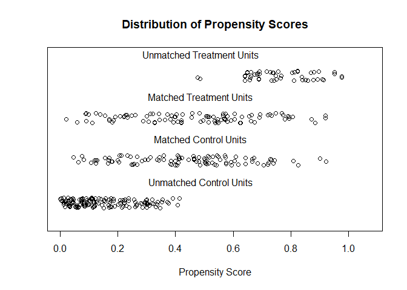

    ## [1] "To identify the units, use first mouse button; to stop, use second."

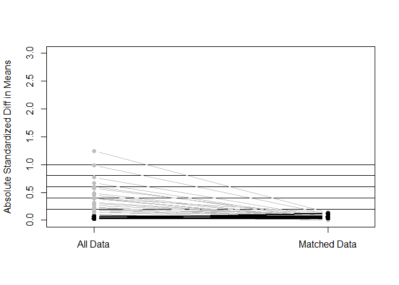

    ## [1] "To identify the variables, use first mouse button; to stop, use second."

    ## integer(0)

``` r
do_checks_I_want(op_cr0_ps1)
```

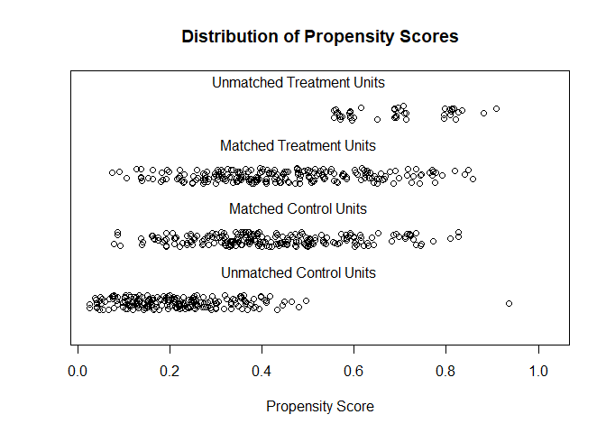

    ## [1] "To identify the units, use first mouse button; to stop, use second."

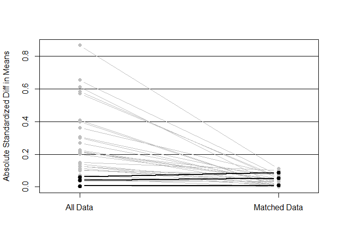

    ## [1] "To identify the variables, use first mouse button; to stop, use second."

    ## integer(0)

``` r
do_checks_I_want(cr_op1_ps0)
```

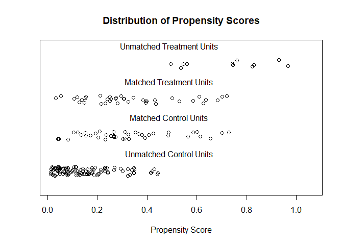

    ## [1] "To identify the units, use first mouse button; to stop, use second."

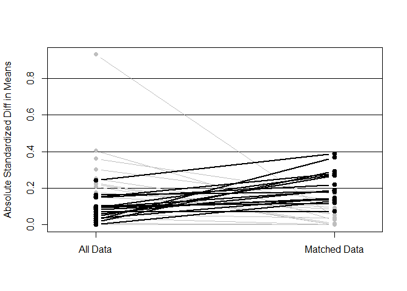

    ## [1] "To identify the variables, use first mouse button; to stop, use second."

    ## integer(0)

``` r
do_checks_I_want(cr_op1_ps1)
```

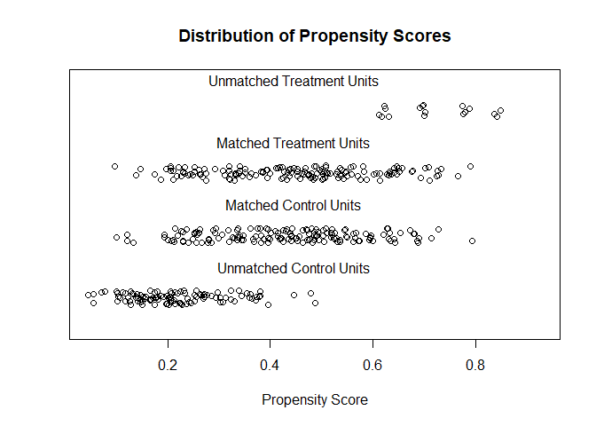

    ## [1] "To identify the units, use first mouse button; to stop, use second."


    ## [1] "To identify the variables, use first mouse button; to stop, use second."

    ## integer(0)

Logistic regression analyses
============================

In this part of the analyses we do the logistic regression analyses.

Function for logistic regressions
---------------------------------

Here we write a function that takes the list of results previously compiled (data and matching results) and adds logistic regression results. We perform two logistic regression analyses: 1. An ancova style analysis with the effect of the independent variable controlled by the propensity score 2. Extending this with an interaction effect to test the assumption of "parallel lines".

Estimated probabilities from 2) will be used in the plots.

``` r
add_glm_tests <- function(results_list) {
  if (results_list$effect_variable == "openPrison") {         # open placement
    f_ancova      <- "reoffenceThisTerm ~ openPrison + distance_logit"
    f_interaction <- "reoffenceThisTerm ~ openPrison * distance_logit"
    
  } else if (results_list$effect_variable == "conditionalReleaseGranted"){         # conditional release
    f_ancova      <- "reoffenceThisTerm ~ conditionalReleaseGranted + distance_logit"
    f_interaction <- "reoffenceThisTerm ~ conditionalReleaseGranted * distance_logit"
    
  } else {
    warning('Could not specificy effect')
  }
  
  used_data <- results_list$data[results_list$data$matched == 1, ]
  
  results_list$glm_ancova      <- glm(f_ancova,      
                                          family = binomial, data = used_data)
  results_list$glm_interaction <- glm(f_interaction, 
                                          family = binomial, data = used_data)

  return(results_list)
}
```

Write a function to get the chi-square value for the models and associated p-values

``` r
get_chi_stats <- function(glm_model) {
  d_chisq = glm_model$null.deviance - glm_model$deviance
  d_df    = glm_model$df.null       - glm_model$df.residual
  p       = 1 - pchisq(q = d_chisq, df = d_df)
  data_frame(d_chisq, d_df, p)
}
```

Run analyses
------------

Use this function on the results lists.

``` r
op_cr0_ps0 <- add_glm_tests(op_cr0_ps0)
op_cr0_ps1 <- add_glm_tests(op_cr0_ps1)

cr_op1_ps0 <- add_glm_tests(cr_op1_ps0)
cr_op1_ps1 <- add_glm_tests(cr_op1_ps1)
```

Results
-------

### Effect: Open Prison. Subset: NOT Supervised

Results for the effect of placement in open prison - in combination with no conditional release - among individuals NOT SUPERVISED during parole

No main effect. Adding interaction term is not a statistically significant improvement.

``` r
summary      (op_cr0_ps0$glm_ancova)
```

    ## 
    ## Call:
    ## glm(formula = f_ancova, family = binomial, data = used_data)
    ## 
    ## Deviance Residuals: 
    ##     Min       1Q   Median       3Q      Max  
    ## -1.5752  -1.2081   0.9441   1.1136   1.3868  
    ## 
    ## Coefficients:
    ##                       Estimate Std. Error z value Pr(>|z|)  
    ## (Intercept)             0.1863     0.2085   0.893    0.372  
    ## openPrisonopen_prison  -0.2111     0.2883  -0.732    0.464  
    ## distance_logit         -0.2374     0.1360  -1.745    0.081 .
    ## ---
    ## Signif. codes:  0 '***' 0.001 '**' 0.01 '*' 0.05 '.' 0.1 ' ' 1
    ## 
    ## (Dispersion parameter for binomial family taken to be 1)
    ## 
    ##     Null deviance: 273.50  on 197  degrees of freedom
    ## Residual deviance: 269.63  on 195  degrees of freedom
    ## AIC: 275.63
    ## 
    ## Number of Fisher Scoring iterations: 4

``` r
get_chi_stats(op_cr0_ps0$glm_ancova)
```

    ## # A tibble: 1 x 3
    ##   d_chisq  d_df     p
    ##     <dbl> <int> <dbl>
    ## 1    3.86     2 0.145

``` r
summary      (op_cr0_ps0$glm_interaction)
```

    ## 
    ## Call:
    ## glm(formula = f_interaction, family = binomial, data = used_data)
    ## 
    ## Deviance Residuals: 
    ##     Min       1Q   Median       3Q      Max  
    ## -1.7371  -1.2756   0.8897   1.0749   1.6173  
    ## 
    ## Coefficients:
    ##                                      Estimate Std. Error z value Pr(>|z|)
    ## (Intercept)                           0.27503    0.21422   1.284    0.199
    ## openPrisonopen_prison                -0.34287    0.30026  -1.142    0.253
    ## distance_logit                        0.03136    0.19775   0.159    0.874
    ## openPrisonopen_prison:distance_logit -0.51377    0.28047  -1.832    0.067
    ##                                       
    ## (Intercept)                           
    ## openPrisonopen_prison                 
    ## distance_logit                        
    ## openPrisonopen_prison:distance_logit .
    ## ---
    ## Signif. codes:  0 '***' 0.001 '**' 0.01 '*' 0.05 '.' 0.1 ' ' 1
    ## 
    ## (Dispersion parameter for binomial family taken to be 1)
    ## 
    ##     Null deviance: 273.50  on 197  degrees of freedom
    ## Residual deviance: 266.19  on 194  degrees of freedom
    ## AIC: 274.19
    ## 
    ## Number of Fisher Scoring iterations: 4

``` r
get_chi_stats(op_cr0_ps0$glm_interaction)
```

    ## # A tibble: 1 x 3
    ##   d_chisq  d_df      p
    ##     <dbl> <int>  <dbl>
    ## 1    7.31     3 0.0627

``` r
anova(op_cr0_ps0$glm_ancova, op_cr0_ps0$glm_interaction, test = "Chisq")
```

    ## Analysis of Deviance Table
    ## 
    ## Model 1: reoffenceThisTerm ~ openPrison + distance_logit
    ## Model 2: reoffenceThisTerm ~ openPrison * distance_logit
    ##   Resid. Df Resid. Dev Df Deviance Pr(>Chi)  
    ## 1       195     269.63                       
    ## 2       194     266.19  1   3.4474  0.06335 .
    ## ---
    ## Signif. codes:  0 '***' 0.001 '**' 0.01 '*' 0.05 '.' 0.1 ' ' 1

### Effect: Open Prison. Subset: Supervised

Results for the effect of placement in open prison - in combination with no conditional release - among individuals SUPERVISED during parole

No main effect. Adding interaction term is not a statistically significant improvement.

``` r
summary      (op_cr0_ps1$glm_ancova)
```

    ## 
    ## Call:
    ## glm(formula = f_ancova, family = binomial, data = used_data)
    ## 
    ## Deviance Residuals: 
    ##     Min       1Q   Median       3Q      Max  
    ## -1.9670  -1.0750  -0.6529   1.1208   2.0289  
    ## 
    ## Coefficients:
    ##                       Estimate Std. Error z value Pr(>|z|)    
    ## (Intercept)            -0.2885     0.1508  -1.914   0.0556 .  
    ## openPrisonopen_prison  -0.2464     0.2013  -1.224   0.2209    
    ## distance_logit         -0.8387     0.1442  -5.818 5.97e-09 ***
    ## ---
    ## Signif. codes:  0 '***' 0.001 '**' 0.01 '*' 0.05 '.' 0.1 ' ' 1
    ## 
    ## (Dispersion parameter for binomial family taken to be 1)
    ## 
    ##     Null deviance: 602.62  on 435  degrees of freedom
    ## Residual deviance: 561.40  on 433  degrees of freedom
    ## AIC: 567.4
    ## 
    ## Number of Fisher Scoring iterations: 4

``` r
get_chi_stats(op_cr0_ps1$glm_ancova)
```

    ## # A tibble: 1 x 3
    ##   d_chisq  d_df             p
    ##     <dbl> <int>         <dbl>
    ## 1    41.2     2 0.00000000112

``` r
summary      (op_cr0_ps1$glm_interaction)
```

    ## 
    ## Call:
    ## glm(formula = f_interaction, family = binomial, data = used_data)
    ## 
    ## Deviance Residuals: 
    ##     Min       1Q   Median       3Q      Max  
    ## -2.1486  -1.0617  -0.6777   1.1346   1.8861  
    ## 
    ## Coefficients:
    ##                                      Estimate Std. Error z value Pr(>|z|)
    ## (Intercept)                           -0.3623     0.1652  -2.193   0.0283
    ## openPrisonopen_prison                 -0.1176     0.2260  -0.520   0.6027
    ## distance_logit                        -1.0412     0.2220  -4.691 2.72e-06
    ## openPrisonopen_prison:distance_logit   0.3676     0.2921   1.258   0.2082
    ##                                         
    ## (Intercept)                          *  
    ## openPrisonopen_prison                   
    ## distance_logit                       ***
    ## openPrisonopen_prison:distance_logit    
    ## ---
    ## Signif. codes:  0 '***' 0.001 '**' 0.01 '*' 0.05 '.' 0.1 ' ' 1
    ## 
    ## (Dispersion parameter for binomial family taken to be 1)
    ## 
    ##     Null deviance: 602.62  on 435  degrees of freedom
    ## Residual deviance: 559.80  on 432  degrees of freedom
    ## AIC: 567.8
    ## 
    ## Number of Fisher Scoring iterations: 4

``` r
get_chi_stats(op_cr0_ps1$glm_interaction)
```

    ## # A tibble: 1 x 3
    ##   d_chisq  d_df             p
    ##     <dbl> <int>         <dbl>
    ## 1    42.8     3 0.00000000268

``` r
anova(op_cr0_ps1$glm_ancova, op_cr0_ps1$glm_interaction, test = "Chisq")
```

    ## Analysis of Deviance Table
    ## 
    ## Model 1: reoffenceThisTerm ~ openPrison + distance_logit
    ## Model 2: reoffenceThisTerm ~ openPrison * distance_logit
    ##   Resid. Df Resid. Dev Df Deviance Pr(>Chi)
    ## 1       433      561.4                     
    ## 2       432      559.8  1   1.6009   0.2058

### Effect: CR. Subset: NOT Supervised

Results for the effect of conditional release - in combination with placement in open prison - among individuals NOT SUPERVISED during parole

No main effect. Adding interaction term is not a statistically significant improvement.

``` r
summary      (cr_op1_ps0$glm_ancova)
```

    ## 
    ## Call:
    ## glm(formula = f_ancova, family = binomial, data = used_data)
    ## 
    ## Deviance Residuals: 
    ##     Min       1Q   Median       3Q      Max  
    ## -0.9495  -0.8848  -0.6296   0.9182   1.9395  
    ## 
    ## Coefficients:
    ##                             Estimate Std. Error z value Pr(>|z|)   
    ## (Intercept)                 -1.04367    0.34832  -2.996  0.00273 **
    ## conditionalReleaseGranted.L -0.58779    0.38089  -1.543  0.12278   
    ## distance_logit               0.07605    0.27349   0.278  0.78096   
    ## ---
    ## Signif. codes:  0 '***' 0.001 '**' 0.01 '*' 0.05 '.' 0.1 ' ' 1
    ## 
    ## (Dispersion parameter for binomial family taken to be 1)
    ## 
    ##     Null deviance: 88.806  on 77  degrees of freedom
    ## Residual deviance: 86.278  on 75  degrees of freedom
    ## AIC: 92.278
    ## 
    ## Number of Fisher Scoring iterations: 4

``` r
get_chi_stats(cr_op1_ps0$glm_ancova)
```

    ## # A tibble: 1 x 3
    ##   d_chisq  d_df     p
    ##     <dbl> <int> <dbl>
    ## 1    2.53     2 0.283

``` r
summary      (cr_op1_ps0$glm_interaction)
```

    ## 
    ## Call:
    ## glm(formula = f_interaction, family = binomial, data = used_data)
    ## 
    ## Deviance Residuals: 
    ##     Min       1Q   Median       3Q      Max  
    ## -0.9968  -0.8695  -0.6306   0.8671   1.8734  
    ## 
    ## Coefficients:
    ##                                            Estimate Std. Error z value
    ## (Intercept)                                -1.05558    0.35463  -2.977
    ## conditionalReleaseGranted.L                -0.68963    0.50152  -1.375
    ## distance_logit                              0.05997    0.27788   0.216
    ## conditionalReleaseGranted.L:distance_logit -0.12478    0.39299  -0.318
    ##                                            Pr(>|z|)   
    ## (Intercept)                                 0.00291 **
    ## conditionalReleaseGranted.L                 0.16910   
    ## distance_logit                              0.82914   
    ## conditionalReleaseGranted.L:distance_logit  0.75086   
    ## ---
    ## Signif. codes:  0 '***' 0.001 '**' 0.01 '*' 0.05 '.' 0.1 ' ' 1
    ## 
    ## (Dispersion parameter for binomial family taken to be 1)
    ## 
    ##     Null deviance: 88.806  on 77  degrees of freedom
    ## Residual deviance: 86.178  on 74  degrees of freedom
    ## AIC: 94.178
    ## 
    ## Number of Fisher Scoring iterations: 4

``` r
get_chi_stats(cr_op1_ps0$glm_interaction)
```

    ## # A tibble: 1 x 3
    ##   d_chisq  d_df     p
    ##     <dbl> <int> <dbl>
    ## 1    2.63     3 0.453

``` r
anova(cr_op1_ps0$glm_ancova, cr_op1_ps0$glm_interaction, test = "Chisq")
```

    ## Analysis of Deviance Table
    ## 
    ## Model 1: reoffenceThisTerm ~ conditionalReleaseGranted + distance_logit
    ## Model 2: reoffenceThisTerm ~ conditionalReleaseGranted * distance_logit
    ##   Resid. Df Resid. Dev Df Deviance Pr(>Chi)
    ## 1        75     86.278                     
    ## 2        74     86.178  1  0.10072    0.751

### Effect: CR. Subset: Supervised

Results for the effect of conditional release - in combination with placement in open prison - among individuals SUPERVISED during parole

No main effect. Adding interaction term is not a statistically significant improvement.

``` r
summary      (cr_op1_ps1$glm_ancova)
```

    ## 
    ## Call:
    ## glm(formula = f_ancova, family = binomial, data = used_data)
    ## 
    ## Deviance Residuals: 
    ##     Min       1Q   Median       3Q      Max  
    ## -1.2011  -0.8842  -0.7280   1.3463   1.8775  
    ## 
    ## Coefficients:
    ##                             Estimate Std. Error z value Pr(>|z|)    
    ## (Intercept)                  -0.9679     0.1431  -6.765 1.34e-11 ***
    ## conditionalReleaseGranted.L  -0.3889     0.1799  -2.161   0.0307 *  
    ## distance_logit               -0.3408     0.1896  -1.797   0.0723 .  
    ## ---
    ## Signif. codes:  0 '***' 0.001 '**' 0.01 '*' 0.05 '.' 0.1 ' ' 1
    ## 
    ## (Dispersion parameter for binomial family taken to be 1)
    ## 
    ##     Null deviance: 374.19  on 305  degrees of freedom
    ## Residual deviance: 365.87  on 303  degrees of freedom
    ## AIC: 371.87
    ## 
    ## Number of Fisher Scoring iterations: 4

``` r
get_chi_stats(cr_op1_ps1$glm_ancova)
```

    ## # A tibble: 1 x 3
    ##   d_chisq  d_df      p
    ##     <dbl> <int>  <dbl>
    ## 1    8.32     2 0.0156

``` r
summary      (cr_op1_ps1$glm_interaction)
```

    ## 
    ## Call:
    ## glm(formula = f_interaction, family = binomial, data = used_data)
    ## 
    ## Deviance Residuals: 
    ##     Min       1Q   Median       3Q      Max  
    ## -1.2016  -0.8841  -0.7280   1.3461   1.8771  
    ## 
    ## Coefficients:
    ##                                              Estimate Std. Error z value
    ## (Intercept)                                -0.9678562  0.1430857  -6.764
    ## conditionalReleaseGranted.L                -0.3885600  0.2023537  -1.920
    ## distance_logit                             -0.3407567  0.1899658  -1.794
    ## conditionalReleaseGranted.L:distance_logit  0.0009277  0.2686523   0.003
    ##                                            Pr(>|z|)    
    ## (Intercept)                                1.34e-11 ***
    ## conditionalReleaseGranted.L                  0.0548 .  
    ## distance_logit                               0.0728 .  
    ## conditionalReleaseGranted.L:distance_logit   0.9972    
    ## ---
    ## Signif. codes:  0 '***' 0.001 '**' 0.01 '*' 0.05 '.' 0.1 ' ' 1
    ## 
    ## (Dispersion parameter for binomial family taken to be 1)
    ## 
    ##     Null deviance: 374.19  on 305  degrees of freedom
    ## Residual deviance: 365.87  on 302  degrees of freedom
    ## AIC: 373.87
    ## 
    ## Number of Fisher Scoring iterations: 4

``` r
get_chi_stats(cr_op1_ps1$glm_interaction)
```

    ## # A tibble: 1 x 3
    ##   d_chisq  d_df      p
    ##     <dbl> <int>  <dbl>
    ## 1    8.32     3 0.0398

``` r
anova(cr_op1_ps1$glm_ancova, cr_op1_ps1$glm_interaction, test = "Chisq")
```

    ## Analysis of Deviance Table
    ## 
    ## Model 1: reoffenceThisTerm ~ conditionalReleaseGranted + distance_logit
    ## Model 2: reoffenceThisTerm ~ conditionalReleaseGranted * distance_logit
    ##   Resid. Df Resid. Dev Df   Deviance Pr(>Chi)
    ## 1       303     365.87                       
    ## 2       302     365.87  1 1.1924e-05   0.9972

Plots
=====

Write a function to plot interesting results

``` r
make_graph <- function (results_list, ind_variable, 
                        my_x_lab = NULL, y_labels = FALSE,
                        facet_labels = FALSE, legend = FALSE) {


if          (ind_variable == "openPrison") {
  title         =  "Effect of placement"
  legend_name   =  "Placement"
  legend_breaks =  c("open_prison", "closed_prison")
  legend_labels =  c("Open Prison", "Closed Prison")
  propens_score = "distance_prob"

} else if (ind_variable == "conditionalReleaseGranted") {
  title         =  "Effect of conditional release (CR)"
  legend_name   =  "CR Status"
  legend_breaks =  c("cr_granted", "cr_not_granted")
  legend_labels =  c("Successful CR", "No CR")
  propens_score = "distance_prob"

} else {
    warning("Could not find effect")
}
  
tick_breaks <-  c(0, 0.25, 0.5, 0.75, 1)
tick_labels <-  c("0", "", ".5", "", "1" )   

# subtitle    <- paste("In combination with" , in_comb_with)
                          
plot_data <- data.frame(
  propensity_score    = results_list$data[[propens_score]],
  est_prob_recidivism = predict(results_list$glm_interaction, 
                                type = "response", newdata = results_list$data),
  ind_variable        = results_list$data[[ind_variable]],
  matched_f           = results_list$data[["matched_f"]]
) 


if (y_labels == TRUE) {
  my_y_lab_line   <- "Est. prob. of recidivism"
  my_y_lab_jitter <- "Match category" 
} else {
  my_y_lab_line   <- NULL
  my_y_lab_jitter <- NULL 
}

if (y_labels == TRUE) {
  my_y_lab_line   <- "Est. prob. of recidivism"
  my_y_lab_jitter <- "Match category" 
} else {
  my_y_lab_line   <- NULL
  my_y_lab_jitter <- NULL 
}


if (facet_labels == TRUE) {
  my_strip_text <- element_text()
} else {
  my_strip_text <- element_blank()
}

if (legend == TRUE) {
  legend_pos <- theme(legend.position = c(0.8, 0.8))
} else {
  legend_pos <- theme(legend.position = "none")
}


# A better alternative to the line plot might be to just draw the line generated from regression
                          # coefficients and limit to the max and min propensities
                          

# For the upper line plot only include matched individuals 

# Create the line plot
line_plot <- 
  plot_data %>% 
  filter(matched_f == "Matched") %>% 
  ggplot(aes(x = propensity_score, 
             y = est_prob_recidivism, 
             col = ind_variable)) + 
  geom_line() +
  # ggtitle(title, subtitle = subtitle) +
  xlab(NULL) + 
  ylab(my_y_lab_line) +
  scale_x_continuous(limits = c(0,1), breaks = tick_breaks, labels = NULL) +
  scale_y_continuous(limits = c(0,1), breaks = tick_breaks, labels = tick_labels) +
  scale_color_discrete(name = legend_name,
                       breaks = legend_breaks,
                       labels = legend_labels) +
  theme_tufte(base_family = "sans") +
  legend_pos
  
  

# Create the bottom jitter plot
jitter_plot <- plot_data %>% 
  ggplot(aes(x = propensity_score,
             y = ind_variable,
             col = ind_variable)) +
  geom_jitter(alpha = 0.3) +
  xlab(my_x_lab) +
  ylab(my_y_lab_jitter) +
  scale_x_continuous(limits = c(0,1), breaks = tick_breaks, labels = tick_labels) +
  scale_y_discrete(breaks = NULL) +
  theme_tufte(base_family = "sans") +
  theme(legend.position = "none", strip.text.y = my_strip_text) + 
  facet_grid(matched_f ~ .) 
  
  
# Translate ggplot objects to grobs         

line_grob <- ggplotGrob(line_plot)
jitter_grob <- ggplotGrob(jitter_plot)

# Determine the size of the three leftmost areas according to the needs of the line_plot
jitter_grob$widths[1:3] <- line_grob$widths[1:3]
# Now set the number of column areas and their widths to be that of the jitter grob
line_grob$widths <- jitter_grob$widths

# Arrange the two grobs in two rows, with the first row being propostionally bigger.
grid.arrange(line_grob, jitter_grob, nrow = 2, heights = c(1.3,1))
}
```

Make the actual grafs

``` r
g_open_no_superv<-
make_graph(op_cr0_ps0, "openPrison", 
           y_labels = TRUE,
           legend = TRUE)
```

    ## Warning: Removed 1 rows containing missing values (geom_point).

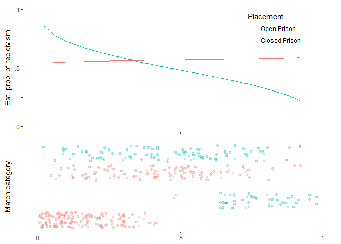

``` r
g_open_superv <- 
make_graph(op_cr0_ps1, "openPrison", 
           my_x_lab = "Propensity for open prison",
           y_labels = TRUE)
```

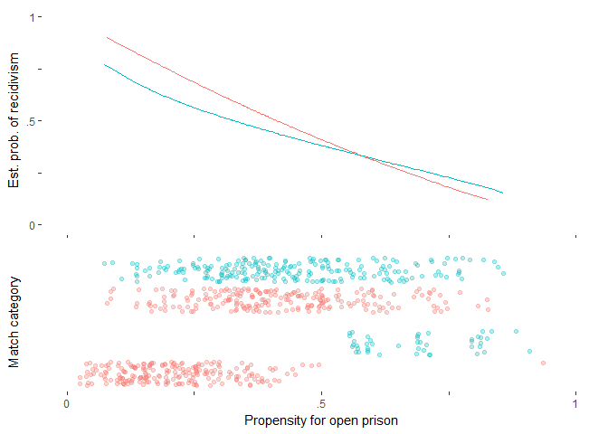

``` r
g_cond_no_superv <-
make_graph(cr_op1_ps0, "conditionalReleaseGranted",
           facet_labels = TRUE,
           legend = TRUE)
```

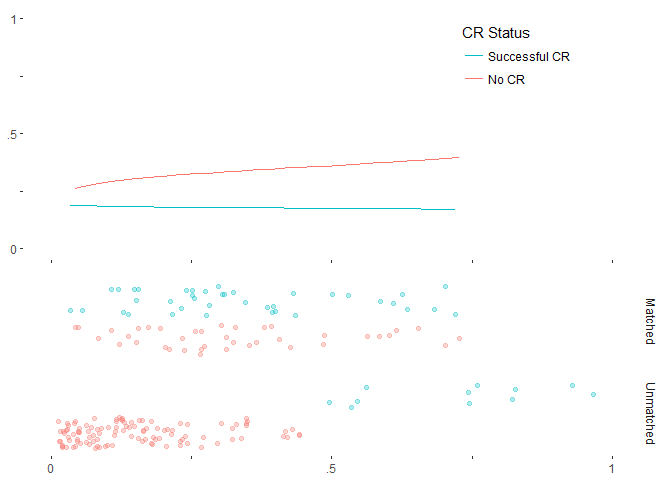

``` r
g_cond_superv <- 
make_graph(cr_op1_ps1, "conditionalReleaseGranted",
           facet_labels = TRUE,
           my_x_lab = "Propensity for CR")
```


Combine grobs

``` r
grid.arrange(grobs = list(g_open_no_superv, g_cond_no_superv, 
                          g_open_superv,    g_cond_superv), 
             nrow = 2, ncol = 2)
```

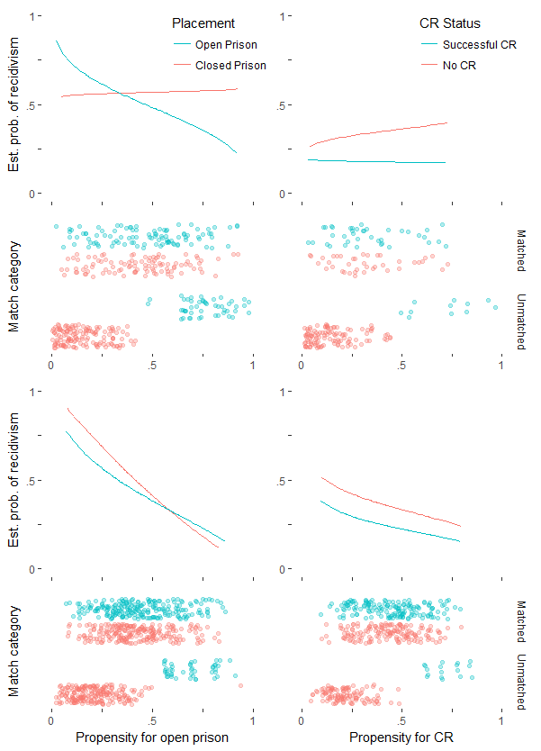
