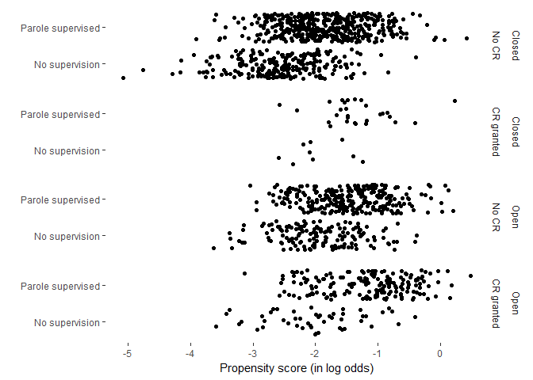

Calculate 'overarching propensity' for full sample
================
Benny Salo
2018-06-18

Here we calculate an *overarching propensity score* for the full sample. This is the propensity to be placed in open prison and to ,in addition, be granted and successfully conclude a conditional release.

This overarching propensity score will be used to make groups comparable in two ways. 1. We will create a jitter plot to compare the propensity in four groups - *open* prison *with* conditional release - *open* prison *without* conditional release - *closed* prison *with* conditional release - *closed* prison *without* conditional release

1.  We will do a median split on propensity score to examine if effects are different for high and low propensity individuals. For this we want comparable propensity scores for each analysis.

For balancing we will instead use a custom propensity score for the specific sample to optimize balance. This will in effect be three different propensity scores: - The propensity to be placed in open prison. - The propensity to be granted conditional release. - The propensity to be placed in open prison *and* be granted conditional release.

That is, different propensity scores will be calculated for different groups for the purpose of balancing.

Load and setup
--------------

``` r
devtools::wd()
analyzed_data_plac <- readRDS("not_public/analyzed_data_plac.rds")

devtools::load_all(".")
library(tidyverse)
```

Analyses
--------

Run logistic regression model. Predict placement in open prison plus successful conditional release from supervision of parole and all potential confounders.

``` r
overarch_propensity_fit <-
  glm(
    formula = write_formula(lhs = "open_and_cr01", 
                            rhs = c("supervisedParole", potential_confounders)),
    data    = analyzed_data_plac,
    family  = "binomial")
```

Calculate propensity scores as log odds and save in data frame.

``` r
analyzed_data_plac$overarch_propensity <- predict(overarch_propensity_fit)
```

Save the data including the new variable.

``` r
devtools::wd()
saveRDS(analyzed_data_plac, "not_public/analyzed_data_plac.rds")
```

Descriptive jitterplot
----------------------

``` r
levels(analyzed_data_plac$openPrison) <- c("Closed", "Open")
levels(analyzed_data_plac$conditionalReleaseOutcome) <- c("No CR", "CR granted")
levels(analyzed_data_plac$supervisedParole) <- c("No supervision", "Parole supervised")

ggplot(analyzed_data_plac, aes(x = overarch_propensity,
                               y = supervisedParole)) + 
  geom_jitter() + 
  ylab("") +
  xlab("Propensity score (in log odds)") +
  facet_grid(openPrison + conditionalReleaseOutcome ~ .) +
  ggthemes::theme_tufte(base_family = "sans")
```



Median propensity
-----------------

``` r
median_overaching_propensity <- median(analyzed_data_plac$overarch_propensity)
```
