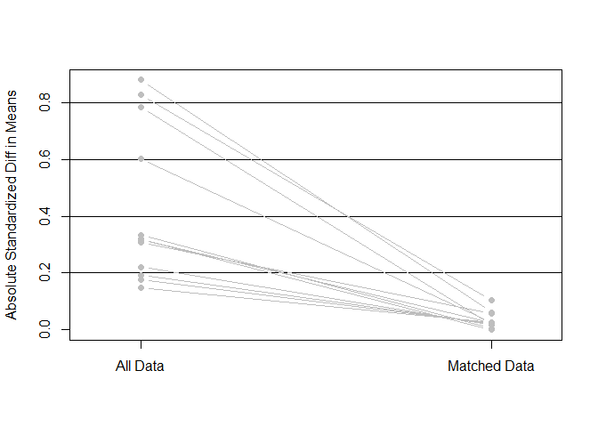
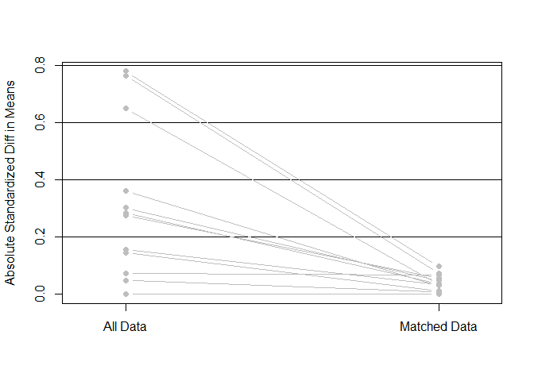

Group and match
================
Benny Salo
2018-06-26

Load and setup
--------------

``` r
rm(list = ls())
devtools::wd()
analyzed_data_plac <- readRDS("not_public/analyzed_data_plac.rds")

devtools::load_all(".")
library(tidyverse)
```

### Helper functions

#### Intiate lists to hold information pertaining to a given comparison

``` r
init_my_list <- function() {
  out <- list(effect_variable = NA,
              data = NA,
              matchit_output = NA,
              matched_data = NA)
}
```

### Create column for characterization as high or low propensity group

``` r
split_point <- median(analyzed_data_plac$overarch_propensity)
```

Function for finding the row numbers of matched observations in either high or low propensity group.

``` r
get_prop_group_i <- function(matched_data, 
                             matchit_output, 
                             hi_or_low = "none") {
  
  # Shorten name
  m_matrix <- matchit_output$match.matrix
  
  # Get row numbers for all matched treated observations
  # (row names in m_matrix and m_data is taken from original data from )
  lgl_i_UNmatched_treated <- apply(m_matrix, MARGIN = 1, anyNA)
  rn_matched_treated      <- row.names(m_matrix[!(lgl_i_UNmatched_treated), ,
                                                drop = FALSE])
  
  # Get row numbers for matched treated observations in either high or low group
  if (hi_or_low == "high") {
    lgl_hi     <- matched_data$overarch_propensity > split_point
    rn_hi      <- row.names(matched_data[lgl_hi, , drop = FALSE])
    
    rn_treated <- rn_hi[rn_hi %in% rn_matched_treated]
    
    
  } else if (hi_or_low == "low") {
    lgl_lo     <- matched_data$overarch_propensity <= split_point
    rn_lo      <- row.names(matched_data[lgl_lo, ,
                                         drop = FALSE])
    
    rn_treated <- rn_lo[rn_lo %in% rn_matched_treated]
 
  } else {
    stop("'hi_or_low' needs to be defined as 'high' or 'low'", call. = FALSE)
  }
  #  Get the controls that is paried with the given treated observations 
  rn_control <- as.numeric(m_matrix[row.names(m_matrix) %in% rn_treated, ,
                                    drop = FALSE])
  rn_control <- rn_control[!(is.na(rn_control))]
  # Combine the two vectors of row numbers
  return(c(rn_treated, rn_control))
  
}

add_propensity_group <- function(comp_list) {
  comp_list$matched_data$propensity_group <- 
    factor(rep(NA, nrow(comp_list$matched_data)), levels = c("low", "high"))
  
  low_index  <- get_prop_group_i(comp_list$matched_data, 
                                 comp_list$matchit_output, "low")
  comp_list$matched_data[as.character(low_index),
                         "propensity_group"] <- "low"  
  
  high_index <- get_prop_group_i(comp_list$matched_data, 
                                 comp_list$matchit_output, "high") 
  comp_list$matched_data[as.character(high_index),
                         "propensity_group"] <- "high"
  
  return(comp_list)
}
```

Create subsets
--------------

There number of individuals, that were placed in closed prison but receiving conditional release, are not enough for us to attempt meaningful matching. The three other combinations of conditions will be compared.

We start by creating these three subsets.

``` r
set_1_open_yesCR <- 
  dplyr::filter(analyzed_data_plac,
                openPrison == "Open_prison" &
                  conditionalReleaseOutcome == "Successful_conditional_release")

set_2_open_noCR  <- 
  dplyr::filter(analyzed_data_plac,
                openPrison == "Open_prison" &
                  conditionalReleaseOutcome == "No_conditional_release")

set_3_closed_noCR <- 
  dplyr::filter(analyzed_data_plac,
                openPrison == "Closed_prison" &
                  conditionalReleaseOutcome == "No_conditional_release")
```

Matching
--------

We compare the three groups pairwise and do matching separately for all three comparisons. The same settings are used in all matching but the data and what treatment is of interest varies. This means that a customized propensity score is calculated for each matching. The propensity scores lacks meaning in themselves but customized propensity scores should lead to better balance between compared groups - which is what we care about.

We use `MatchIt::matchit` with the following settings: - `formula`: The propensity is calculated for the propensity for the treatment that separates the two groups with the previously identified potential confounders as predictors. - `exact`: We use exact matching for "supervision of parole". This variable is partly a condition variable and we find it worthwhile to compare individuals under supervision to other individuals under supervision. - `method`: *nearest neighbor matching* is used - `caliper`: neighbors within 0.2 standard deviations on the customized propensity score are considered - `m.order`: we use the default of matching treated to control beginning with the largest propensity scores and working systematically down - `ratio`: we match 1 treated to 1 control (default made explicit)

### Function used

``` r
do_all_matching <- function(comp_list) {
  # Put my_data in global environment for match.data to work
  my_data   <<- comp_list$data
 
  comp_list$matchit_output  <-     
    MatchIt::matchit(
      # `potential_confounders` is created in 02_selecting_covariates
      formula  = write_formula(lhs = comp_list$effect_variable,
                               rhs = potential_confounders),
      exact    = "supervisedParole",
      data     = my_data,
      method   = "nearest",
      caliper  = 0.2,
      m.order  = "largest",
      ratio    = 1
      )
  
  comp_list$matched_data    <- MatchIt::match.data(comp_list$matchit_output)
  comp_list                 <- add_propensity_group(comp_list)
  
  rm(my_data, envir = .GlobalEnv)
  
  return(comp_list)
}
```

### Assertions

1.  The produced list should have the elements
    -   `$effect_variable`
    -   `$data`
    -   `$matchit_output`
    -   `$matched_data`
2.  The number of rows in `$data` needs to be the sum of observations.
3.  The number of rows in `$matched_data` should be the number of 1s in (or sum of) the weights vector in `$matchit_output` (indicating whether the observation was matched \[1\] or not \[0\]).
4.  The length of the vector indicating if the observation was matched (in `$matchit_output`, needs to be the sum of the observations in the two groups)
5.  The number of observations in the high and in the low propensity group should be even numbers (since they are made up of pairs)

``` r
make_my_assertions <- function(comp_list, n1, n2) {
  # Assertion 1
  stopifnot(names(comp_list) == c("effect_variable", 
                                  "data", 
                                  "matchit_output", 
                                  "matched_data"))
  # Assertion 2
  stopifnot(length(comp_list$matchit_output$weights) == n1 + n2)
  # Assertion 3
  stopifnot(nrow(comp_list$data) == n1 + n2)
  # Assertion 4
  stopifnot(nrow(comp_list$matched_data) == sum(comp_list$matchit_output$weights))
  # Assertion 5
  stopifnot(sum(comp_list$matched_data$propensity_group == "low") %% 2 == 0)
  stopifnot(sum(comp_list$matched_data$propensity_group == "high") %% 2 == 0)
  
  print("Five assertions passed")
}
```

Putting it all together
-----------------------

### `comp_1_vs_2`

Matching observations that allows comparisons between individuals - placed in open prison *and* granted conditional release, n = 220 - placed in open prison *not* granted conditional release, n = 411

Difference in treatment: `cond01`- granted conditional release

``` r
comp_1_vs_2 <- init_my_list()

comp_1_vs_2$effect_variable <- "cond01"
comp_1_vs_2$data            <- rbind(set_1_open_yesCR, set_2_open_noCR)

comp_1_vs_2 <- do_all_matching(comp_1_vs_2)

make_my_assertions(comp_1_vs_2, 220, 411)
```

    ## [1] "Five assertions passed"

Check balance

``` r
plot(summary(comp_1_vs_2$matchit_output, standardize = TRUE))
```


    ## [1] "To identify the variables, use first mouse button; to stop, use second."

    ## integer(0)

### `comp_1_vs_3`

Matching observations that allows comparisons between individuals - placed in *open* prison *and* granted conditional release, n = 220 - placed in *closed* prison *not* granted conditional release, n = 668

Difference in treatment: `open_and_cr01`- placed in *open* prison and *granted* conditional release

``` r
comp_1_vs_3 <- init_my_list()

comp_1_vs_3$effect_variable <- "open_and_cr01"
comp_1_vs_3$data            <- rbind(set_1_open_yesCR, set_3_closed_noCR)

comp_1_vs_3 <- do_all_matching(comp_1_vs_3)

make_my_assertions(comp_1_vs_3, 220, 668)
```

    ## [1] "Five assertions passed"

Check balance

``` r
plot(summary(comp_1_vs_3$matchit_output, standardize = TRUE))
```



    ## [1] "To identify the variables, use first mouse button; to stop, use second."

    ## integer(0)

### `comp_2_vs_3`

Matching observations that allows comparisons between individuals - placed in *open* prison not granted conditional release, n = 411 - placed in *closed * prison not granted conditional release, n = 668

Difference in treatment: `open01`- placed in *open* prison

``` r
comp_2_vs_3 <- init_my_list()

comp_2_vs_3$effect_variable <- "open01"
comp_2_vs_3$data            <- rbind(set_2_open_noCR, set_3_closed_noCR)

comp_2_vs_3 <- do_all_matching(comp_2_vs_3)

make_my_assertions(comp_2_vs_3, 411, 668)
```

    ## [1] "Five assertions passed"

Check balance

``` r
plot(summary(comp_2_vs_3$matchit_output, standardize = TRUE))
```



    ## [1] "To identify the variables, use first mouse button; to stop, use second."

    ## integer(0)
