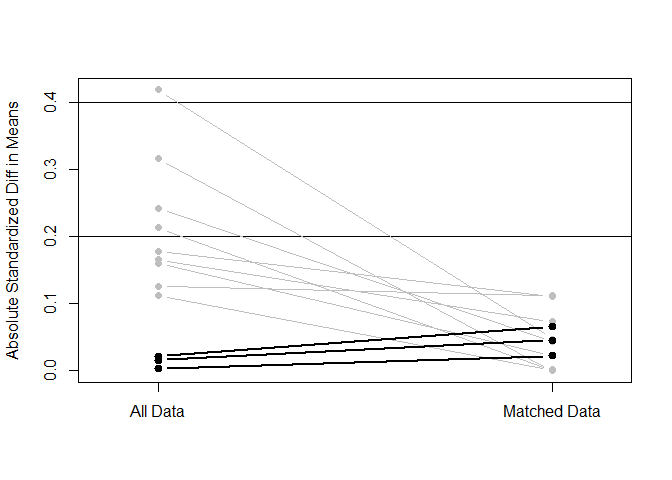
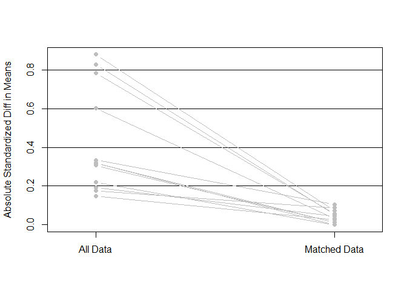
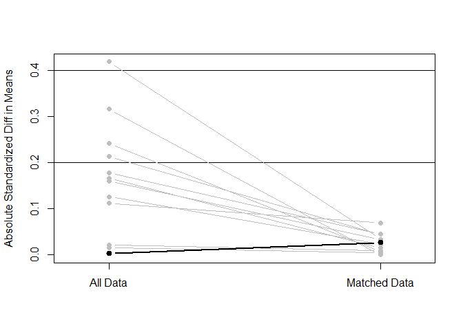

Group and match
================
Benny Salo
2018-06-19

Load and setup
--------------

``` r
devtools::wd()
analyzed_data_plac <- readRDS("not_public/analyzed_data_plac.rds")

devtools::load_all(".")
library(tidyverse)
```

Create subsets
==============

There number of individuals, that were placed in closed prison but receiving conditional release, are not enough for us to attempt meaningful matching. The three other combinations of conditions will be compared.

``` r
set_1_open_yesCR <- 
  dplyr::filter(analyzed_data_plac,
                openPrison == "Open_prison" &
                  conditionalReleaseOutcome == "Successful_conditional_release")

set_2_open_noCR  <- 
  dplyr::filter(analyzed_data_plac,
                openPrison == "Open_prison" &
                  conditionalReleaseOutcome == "No_conditional_release")

set_3_closed_noCR <- 
  dplyr::filter(analyzed_data_plac,
                openPrison == "Closed_prison" &
                  conditionalReleaseOutcome == "No_conditional_release")
```

Matching
--------

We do matching separately for all comparisons. The same settings are used in all matching but the data and what treatment is of interest varies. That means that a customized propensity score is calculated for each matching. The propensity scores lacks meaning in themselves but Customized propensity scores should lead to better balance between compared groups - which is what matters.

We use `MatchIt::matchit` with the following settings: - `formula`: The propensity is calculated for the propensity for the treatment that separates the two groups with the previously identified potential confounders as predictors. - `exact`: Exact matching is for supervision of parole. This is to partly a condition variable and we find it worthwhile to compare individuals under supervision to other individuals under supervision. - `method`: *nearest neighbor matching* is used - `caliper`: neighbors within 0.2 standard deviations are considered - `m.order`: we use the default of matching treated to control beginning with the largest propensity scores and working systematically down - `ratio`: we match 1 treated to 1 control (default made explicit)

``` r
my_matching <- function(subset_data, treatment) {
  MatchIt::matchit(
    formula  = write_formula(lhs = treatment, rhs = potential_confounders),
    exact    = "supervisedParole",
    data     = subset_data,
    method   = "nearest",
    caliper  = 0.2,
    m.order  = "largest",
    ratio    = 1)
}
```

Matching observations that allows comparisons between individuals - placed in open prison *and* granted conditional release - placed in open prison *not* granted conditional release

Difference in treatment: `cond01`- granted conditional release

``` r
match_1_vs_2 <- 
  my_matching(subset_data = rbind(set_1_open_yesCR, set_2_open_noCR),
              treatment   = "cond01")
```

Matching observations that allows comparisons between individuals - placed in *open* prison *and* granted conditional release - placed in *closed* prison *not* granted conditional release

Difference in treatment: `open_and_cr01`- placed in *open* prison and *granted* conditional release

``` r
match_1_vs_3 <- 
  my_matching(subset_data = rbind(set_1_open_yesCR, set_3_closed_noCR),
              treatment   = "open_and_cr01")
```

Matching observations that allows comparisons between individuals - placed in *open* prison not granted conditional release - placed in *closed * prison not granted conditional release

Difference in treatment: `open01`- placed in *open* prison

``` r
match_2_vs_3 <- 
  my_matching(subset_data = rbind(set_2_open_noCR, set_3_closed_noCR),
              treatment   = "open01")
```

Check balance
-------------

Individuals in open prison - conditional release granted vs not granted

``` r
plot(summary(match_1_vs_2, standardize = TRUE))
```



    ## [1] "To identify the variables, use first mouse button; to stop, use second."

    ## integer(0)

Individuals in open prison and granted conditional release vs in closed and not granted conditional release

``` r
plot(summary(match_1_vs_3, standardize = TRUE))
```



    ## [1] "To identify the variables, use first mouse button; to stop, use second."

    ## integer(0)

Individuals not granted conditional release - placed in open vs placed in closed.

``` r
plot(summary(match_2_vs_3, standardize = TRUE))
```



    ## [1] "To identify the variables, use first mouse button; to stop, use second."

    ## integer(0)
